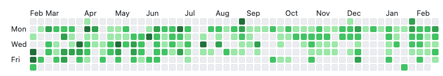

# Grease the Groove

A tracker for Movement Snacks or for recording Grease the Groove sessions if like me, you are inspired by Pavel Tsatsouline.

It was started as a solo hackdays project to give me an opportunity to see what turbo is all about. Haven't got that far yet though.

## Plan

- create an active_day, then within that create a session that you can then add exercises and record reps/weight
- allow creation of user defined exercises as well some pre-prepared examples
- sessions and exercises to be draggable
- on the homepage show a github style heat map for active_days, colour density according to session count or volume

## To run

- bundle install
- bin/dev
